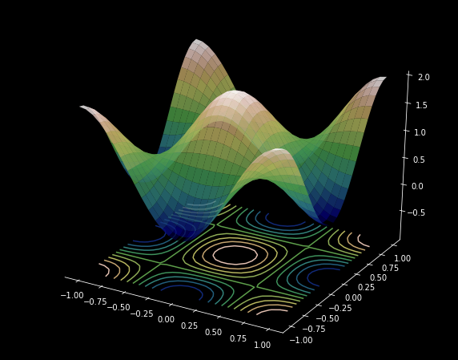

# Mathematics using python - Summer 2020

This repository contains the code and animations written as part of the Summer Fellowship 2020 at FOSSEE (Free/Libre and Open Source Software for Education), IIT Bombay. Lecture notes can be found at [FOSSEE Animations](https://math.animations.fossee.in/). 

As part of the fellowship, the following lecture notes were created by me - 
- [Gradient](https://math.animations.fossee.in/contents/calculus-of-several-variables/integrals-of-multivariable-functions/gradient)
- [Curl and Divergence](https://math.animations.fossee.in/contents/calculus-of-several-variables/div-grad-curl-and-all-that/curl-and-divergence)
- [Conservative Fields, Path Independance, Gradient Fields](https://math.animations.fossee.in/contents/calculus-of-several-variables/div-grad-curl-and-all-that/conservative-fields,-path-independance,-gradient-fields)
- [Curl and Conservative Fields](https://math.animations.fossee.in/contents/calculus-of-several-variables/div-grad-curl-and-all-that/vec-f-is-conservative-implies-curl-f=0)
- [Green's Theorem](https://math.animations.fossee.in/contents/calculus-of-several-variables/div-grad-curl-and-all-that/green's-theorem)

This [report](MathematicsUsingPython-PadmapriyaMohan-FSF-2020.pdf) summarises my contributions.

The animations, some of which are sampled below, were created using [manim](https://github.com/3b1b/manim), [mayavi](https://docs.enthought.com/mayavi/mayavi/), and [matplotlib](https://matplotlib.org/).

